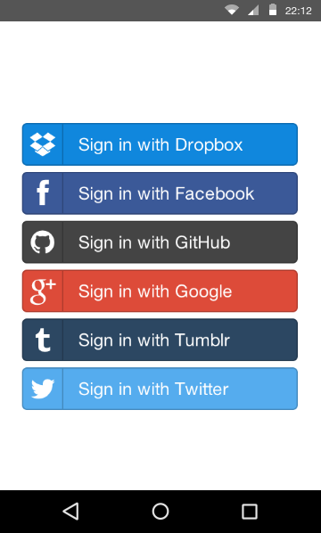
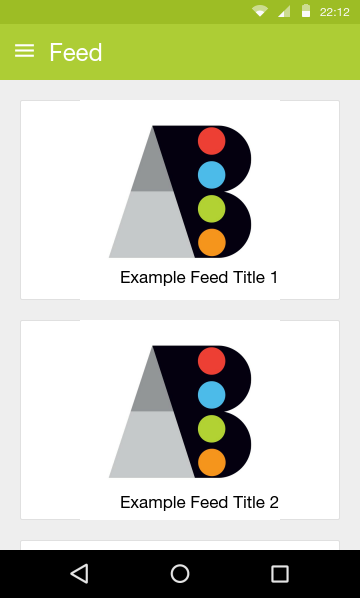
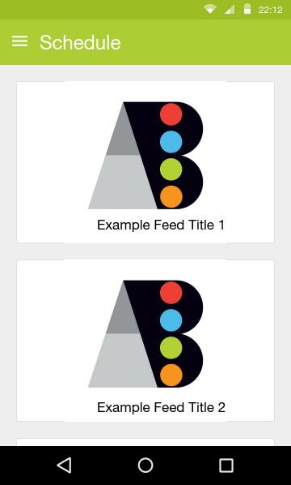
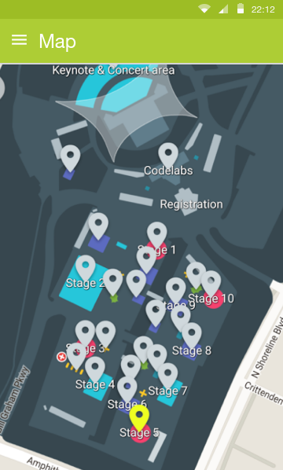

# Conference App (Android) for Systers

An android app to facilitate the attendees of Grace Hopper Celebration conference with features to create their own schedule, see speakers and maps to navigate throught the conference.

A brief overview of features of the app:

 * Social login features (Google, Facebook and Github logins should be enough).
 * Sqlite or Realm for providing offline access to schedules and other data.
 * Integration with the etouches API for data.
 * Intuitive UI/UX which follows the material design guidelines as suggested by Google.
 * Continuous integration server setup (Travis CI is a good option) so that future contributors can contribute with breaking the app.

## Mockups for the app

